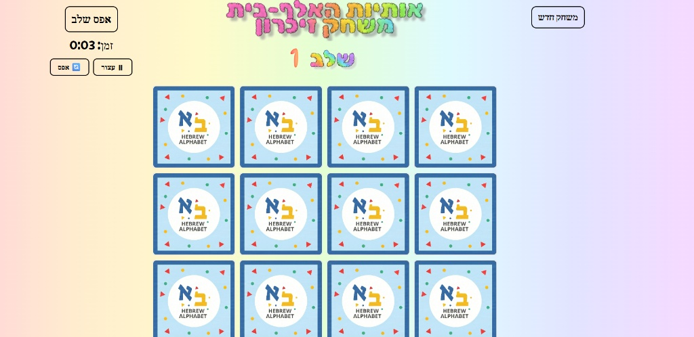
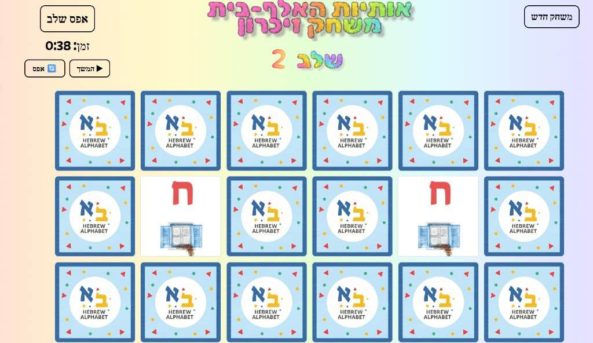

# 🧠 Hebrew Alphabet - Memory Card Game

An interactive and educational memory card game built with **React**. This game helps users learn the Hebrew Alphabet (Alef-Bet) through visual and auditory feedback across progressive stages.

## 🚀 [Play the Live Demo on Netlify](https://memory-game-hebrew.netlify.app/)

---

## 📸 Screenshots

| Stage 1: The Beginning | Stage 2: Progressing |
| :---: | :---: |
|  |  |
---

## ✨ Features
* **Progressive Difficulty:** Multiple stages with increasing numbers of cards.
* **Educational Audio:** 🔊 **Sound feedback for each letter** – hear the pronunciation when a card is flipped!
* **Visual Learning:** Clear, colorful Hebrew letter cards.
* **Responsive Design:** Optimized for both desktop and mobile play.

## 🛠 Installation & Setup

To run this project locally:

1. **Clone the repository:**
   ```bash
   git clone [https://github.com/your-username/Memory-Game-Hebrew-Alphabet.git](https://github.com/your-username/Memory-Game-Hebrew-Alphabet.git)

2. **Install dependencies:**
```bash
npm install

```


3. **Run the app:**
```bash
npm start

```


## 🤝 Contributing

Pull requests are welcome! For major changes, please open an issue first to discuss what you would like to change.

## 📄 License

This project is licensed under the **MIT License**. See the [LICENSE](https://www.google.com/search?q=LICENSE) file for details.

---

Created with ❤️ by **Koral**

